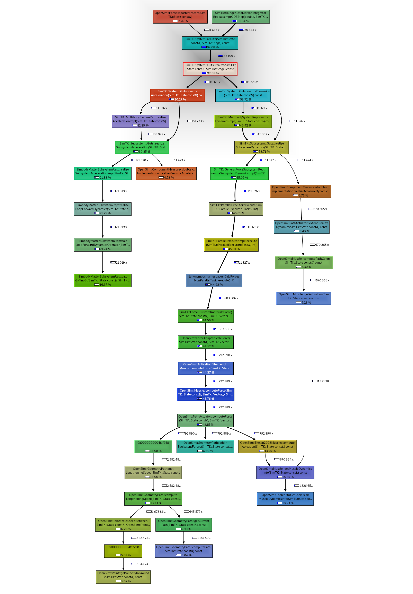

# osimperf

A benchmark suite for measuring OpenSim's overall simulation
performance.

This benchmark suite is used to measure OpenSim's *overall*
(i.e. top-level) performance. Key points:

- This is a **macro**benchmarking suite. It runs complete (end-to-end)
  simulations of typical (for users) models in a clean directory

- Benchmarks use the `opensim-cli` binary to isolate simulation
  performance from GUI performance.

- Multiple measurement/profiling methods are available, including
  `callgrind`ing each test case, `perf record`ing each case,
  etc. `stat`, which is the most basic measurement, only records the
  wall time of the simulation (which may include suite overhead from
  spawning the process, etc.)


## Usage

To define a test, create an `osimperf.conf` file in a
subdirectory. See `ToyDropLanding/` in this repo as an example. The
`osimperf` script globs all subdirectories in the current directory
(or whatever directory is defined by `--tests`) with
`**/osimperf.conf`.

The top-level test driver, `osimperf`, contains a collection of
subcommands that are useful in different contexts. See `osimperf
--help` for details. Some example usages:

```bash
# list all test suites (e.g. ToyDropLanding)
osimperf ls

# use a different dir when searching for tests and list that
osimperf --tests other-tests/ ls

# assuming `opensim-cmd` is on the PATH, take a basic time
# measurement of a test suite
osimperf stat ToyDropLanding

# as above, but with more detailed output and a different number
# of repeats
osimperf --verbose stat ToyDropLanding --repeats 8

# record a `valgrind` (callgrind) and `perf` profile of a test suite
osimperf record -o profile-results/ ToyDropLanding

# compare two opensim-cmd binaries against all test suites and emit
# a markdown comparison table
osimperf compare-all /path/to/opensim-cmd /other/opensim-cmd

# advanced: configure an analysis that exercises multiple opensim-cmd
# binaries against all test suites, with repeats, in a random order
osimperf full-analysis-configure /a/opensim-cmd /b/opensim-cmd /c/opensim-cmd > tests-to-run

# advanced: execute a runfile produced by `full-analysis-configure`. If
# applicable, resume from last location
osimperf full-analysis-run tests-to-run results
```


## Examples


### `osimperf record`

`osimperf record` records a profile of a particular commit of
`opensim-cmd`. This example then views the output of `valgrind
--tool=callgrind` output in `kcachegrind`:

```bash
PATH=branches/master/RelWithDebInfo-install/bin/:$PATH

osimperf record -o out/ ToyDropLanding
cd out/ && kcachegrind
```




### `osimperf record` (multiple tests)

Use bash to record multiple test suites:

```bash
PATH=branches/master/RelWithDebInfo-install/bin/:$PATH

for suite in $(osimperf ls); do
    osimperf record -o "${suite}_out/" "${suite}"
done
```

### `osimperf compare-all`

`osimperf compare-all` can be used to compare the top-level
performance of two different `opensim-cmd` binaries. This example
compares the top-level performance change introduced by a PR
([here](https://github.com/opensim-org/opensim-core/pull/2837)):

```bash
lhs=branches/master/RelWithDebInfo-install/bin/opensim-cmd
rhs=branches/perf-reduce-map-lookups/RelWithDebInfo-install/bin/opensim-cmd

osimperf compare-all --repeats 32 $lhs $rhs
```

The output table is a markdown table that can be pasted directly into GitHub:

|                  Test Name | lhs [secs] | σ [secs] | rhs [secs] | σ [secs] | Speedup |
| -------------------------- | ---------- | -------- | ---------- | -------- | ------- |
|                   Gait2354 |       0.26 |     0.00 |       0.26 |     0.00 |    1.01 |
|             ToyDropLanding |      13.74 |     0.01 |      11.89 |     0.01 |    1.16 |
|   ToyDropLanding_nomuscles |       0.43 |     0.00 |       0.43 |     0.00 |    1.00 |
|            passive_dynamic |       4.84 |     0.00 |       4.76 |     0.00 |    1.02 |
| passive_dynamic_noanalysis |       3.05 |     0.00 |       3.00 |     0.00 |    1.02 |
|                      Arm26 |       0.28 |     0.00 |       0.26 |     0.00 |    1.06 |
|             RajagopalModel |      14.27 |     0.01 |      13.32 |     0.41 |    1.07 |


## Model Sources

Sources for some models:

- Tutorials [here](https://simtk-confluence.stanford.edu/display/OpenSim/Examples+and+Tutorials)

- opensim-models [here](https://github.com/opensim-org/opensim-models)

- IK sim [here](https://simtk-confluence.stanford.edu/display/OpenSim/Tutorial+3+-+Scaling%2C+Inverse+Kinematics%2C+and+Inverse+Dynamics)

- ToyDroplanding [here](https://simtk-confluence.stanford.edu/display/OpenSim/Simulation-Based+Design+to+Prevent+Ankle+Injuries)

- Direct from researchers (e.g. Ajay Seth)
